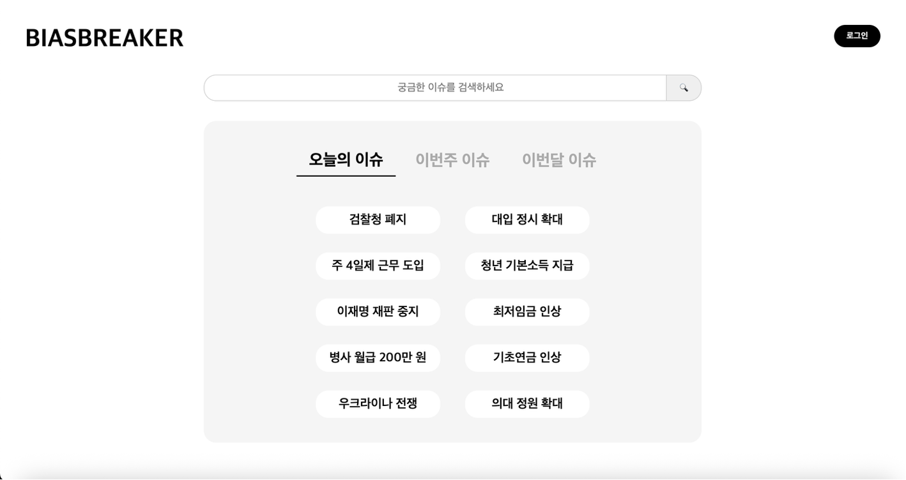
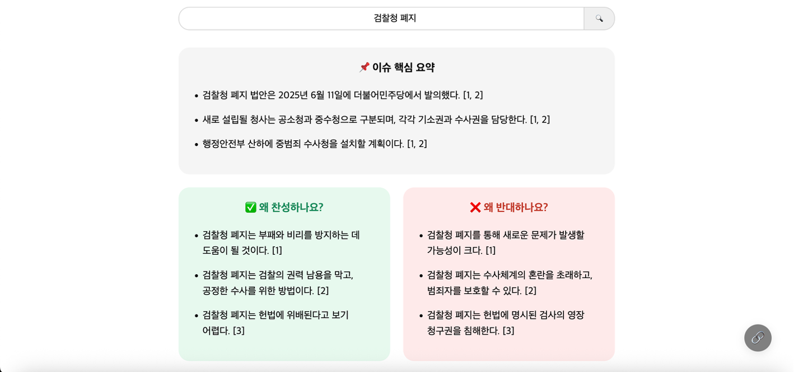

# 📰 BiasBreaker

**BiasBreaker**는 하나의 키워드로 검색하면 **상반된 시각의 뉴스 기사**를 나란히 보여줌으로써, 정보 편향을 줄이고 균형 잡힌 시각을 갖도록 돕는 뉴스 비교 플랫폼입니다.

---

## 🔍 주요 기능

- 🔎 검색 키워드 기반 뉴스 수집 및 찬반 의견 요약 제시
- ⭐ 인기 태그 추천 (오늘/주/월별 이슈 자동 정렬)
- 💡 유사 태그 추천 및 태그 생성 (검색 결과가 없을 때)
- 📜 사용자별 검색 기록 확인 (히스토리)
- 📁 뉴스 비교 결과 PDF 저장 (아카이브)
- 🔐 Google 로그인 (OAuth 2.0)

---

## 🌐 데모 주소

~~[https://cis0105.mycafe24.com]~~

⚠️ 현재 데모 서버는 종료되었습니다.
직접 사용해보고 싶으신 분은 아래의 설치 방법을 따라 로컬 환경에서 실행해보시기 바랍니다.

---

## 📸 스크린샷

### 🖥️ 메인 화면


### 📑 검색 결과 화면


---

## 🛠 기술 스택

| 영역              | 사용 기술                                                                 |
| -----------------| ------------------------------------------------------------------------|
| **프론트엔드**      | HTML, CSS, JavaScript                                                   |
| **백엔드 (API)**   | Python FastAPI (뉴스 요약, 유사 태그 추천 등)                                 |
| **백엔드 (웹 서버)** | PHP (세션 기반 인증 및 페이지 렌더링), MariaDB (검색 기록, 아카이브 저장 등)           |
| **크롤링**         | Python + `requests`, `BeautifulSoup`, `newspaper3k` (뉴스 크롤링 자동화) |
| **기사 요약**      | LLM (`AIDX-ktds/ktdsbaseLM-v0.14-onbased-llama3.1`)                      |
| **태그 추천**      | 문자열 기반 substring 매칭 + KoBERT 임베딩 기반 코사인 유사도                        |
| **사용자 인증**    | Google OAuth 2.0                                                          |
| **PDF 저장**      | Dompdf (한글 폰트 포함)                                                     |
| **호스팅**         | cafe24 (PHP + MariaDB), Jarvislabs (FastAPI, LLM 서버)                   |

---

## 📁 디렉토리 구조

```
llmServer/
│
├── tag_cache/            # 태그별 뉴스 요약/비교 데이터 캐시(JSON)
├── tag_tasks/            # 비동기 태그 생성 상태(진행상황) 저장 디렉토리
├── crawler.py            # 뉴스 본문 크롤링/수집 코드
├── requirements.txt      # Python 의존성 패키지 목록
├── serv.py               # FastAPI 서버 실행(main 엔트리포인트)
├── summary.py            # 기사 요약/뉴스 비교 핵심 로직
├── tag_count.py          # 인기 태그, 카운트 관리(카운트 DB)
├── tag_embedding.py      # 유사 태그 추천(임베딩, 문자열 매칭 등)
├── tag_generate.py       # 태그별 요약/비교 데이터 생성(LLM 호출 등)
│
webServer/
│
├── archives/             # 저장된 PDF 파일(아카이브) 경로
├── fonts/                # NotoSansKR.ttf 등 한글 폰트 파일
├── logos/                # 언론사 로고 이미지
├── vendor/               # Dompdf 등 Composer 패키지 디렉토리
│
├── archive.php           # 아카이브 리스트/다운로드 관련 API
├── composer.json         # PHP composer 패키지 관리 파일
├── composer.lock         # composer.lock(의존성 고정용)
├── db.php                # DB 연결 설정(공통)
├── delete_archive.php    # 아카이브 삭제 API
├── delete_history.php    # 히스토리 삭제 API
├── history.html          # 히스토리/아카이브 확인
├── history.php           # 히스토리 리스트/조회 API
├── index.html            # 검색, 인기 이슈, 로그인 UI(메인)
├── logout.php            # 로그아웃 처리 API
├── me.php                # 로그인 상태 확인 API
├── save_archive.php      # PDF 저장(아카이브) API
├── save_search.php       # 검색 기록 저장 API
├── save_user.php         # 사용자 정보/회원가입 API
├── search_result_page.html # 뉴스 비교 결과 페이지(검색 결과)
```

---

## ⚙️ 설치 방법
BiasBreaker는 FastAPI 기반 LLM 서버와 PHP 기반 웹 서버가 연동된 웹 애플리케이션입니다.
아래 순서대로 설치하면 로컬에서 실행 가능합니다.

1. **저장소 클론 & 설치 (webServer)**
   ```bash
   git clone https://github.com/yourusername/biasbreaker.git
   cd biasbreaker/webServer
   composer install
   ```

2. **데이터베이스 구성**
   1. `db.php` 설정
      - `webServer/db.php` 파일 내 DB 접속 정보 입력
   2. 기본 테이블 생성 예시

   ```sql
   CREATE TABLE search_history (
      id INT AUTO_INCREMENT PRIMARY KEY,
      email VARCHAR(255),
      query TEXT,
      searched_at DATETIME DEFAULT CURRENT_TIMESTAMP
   );

   CREATE TABLE archive_list (
      id INT AUTO_INCREMENT PRIMARY KEY,
      email VARCHAR(255),
      query TEXT,
      pdf_path TEXT,
      created_at DATETIME DEFAULT CURRENT_TIMESTAMP
   );
   ```

3. **Google OAuth 2.0 설정**
   - Google Cloud Console에서 OAuth 클라이언트 ID 생성 (웹 애플리케이션용)
   - 리디렉션 URI 등 설정 후 `login.html` → 로그인 완료 시 `$_SESSION['user']`에 사용자 정보 저장

4. **LLM 서버 설치 (llmServer)**
   ```bash
   cd ../llmServer
   python -m venv venv
   source venv/bin/activate
   pip install -r requirements.txt
   ```

5. **LLM 서버 실행**

   ```bash
   uvicorn serv:app --host 0.0.0.0 --port 8888
   ```
   - `--port`와 `--host`는 필요 시 수정 가능

6. **API 연동 (웹 UI ↔ LLM 서버)**
   - `webServer/index.html, search_result_page.html` 등에서 사용되는 `apiBase` 변수 값을 실제 LLM server 주소로 설정

7. **cafe24 업로드 시 주의사항**
   - `webServer/archives/` 디렉토리는 PDF 저장을 위해 쓰기 권한 부여 필수
   ```bash
   chmod 755 archives
   ```
   - `webServer/vendor` 폴더 함께 업로드 필요
